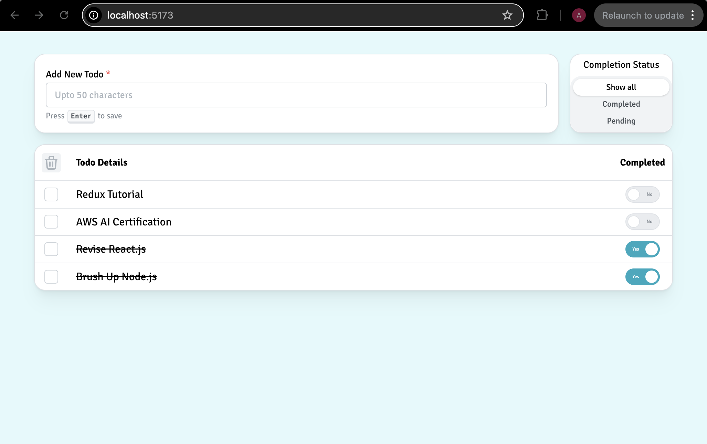

# GraviTODO: A simple To-Do list

This repository is the answer asked for in **Question #4** of the assignment for the role of **Lead MERN Developer** in **Gravity Engineering Services**. It was asked to build a simple **React** app implenting a **To-Do List** consisting of the following features:

1. User should be able to add new tasks.
2. User should be able to delete unnecessary tasks.
3. User can mark the intended tasks as completed.
4. User can filter the tasks based on the completion status.
5. Tasks should persist in local storage and should be loaded even after refreshing the page.

Watch the demo of the implementation below.

[](https://vimeo.com/1069290734/8f73bb5b59)

### How to run it in your local system?

1. Clone the repository.

```
git clone git@github.com:arkachego/gravitodo.git
```

2. Move inside the `gravitodo` folder.

```
cd gravitodo
```

3. Install the dependencies.

```
npm install
```

4. Run the app.

```
npm run dev
```

The app should be up and running in [http://localhost:5173](http://localhost:5173)